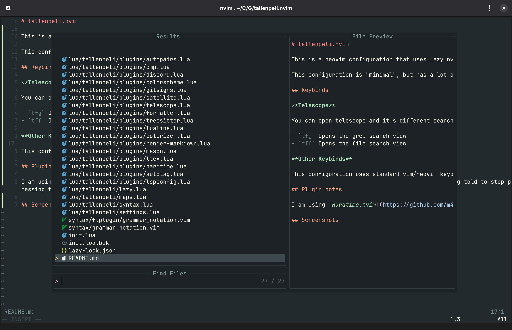
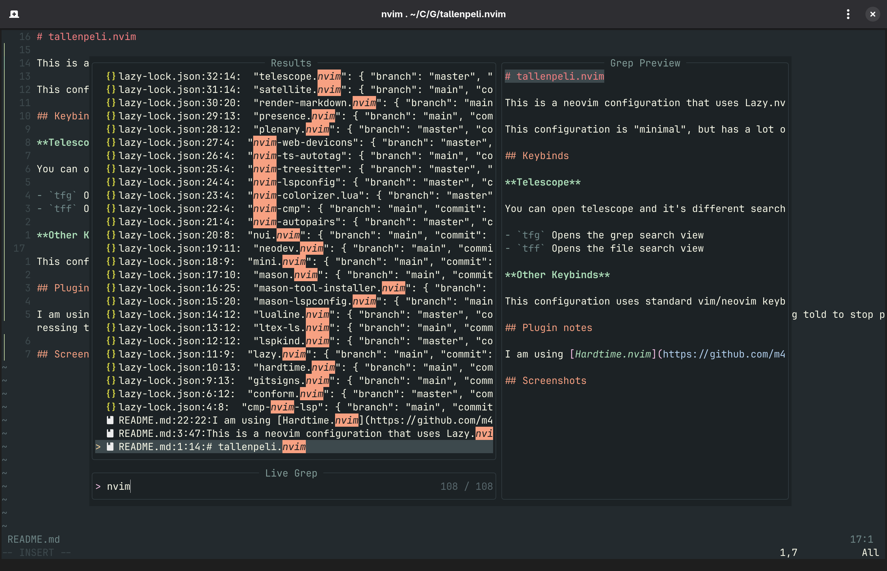
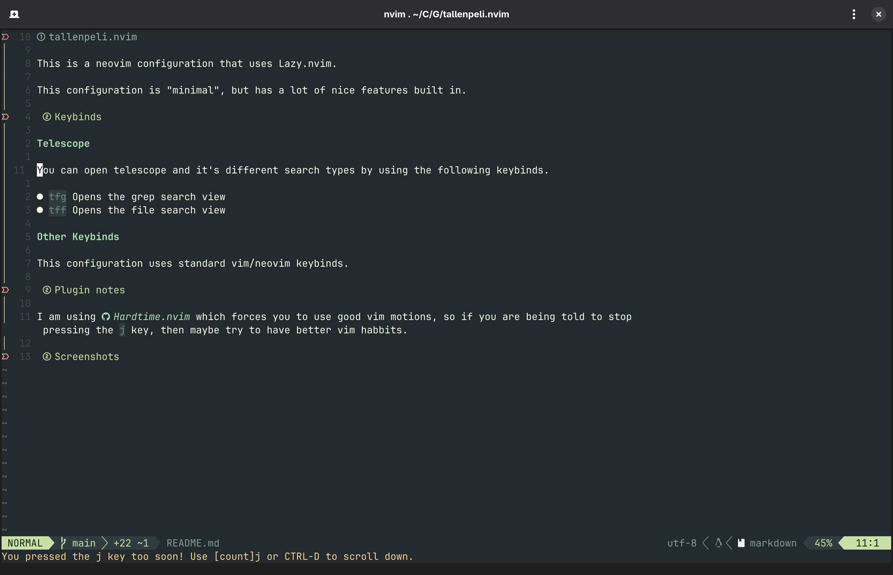
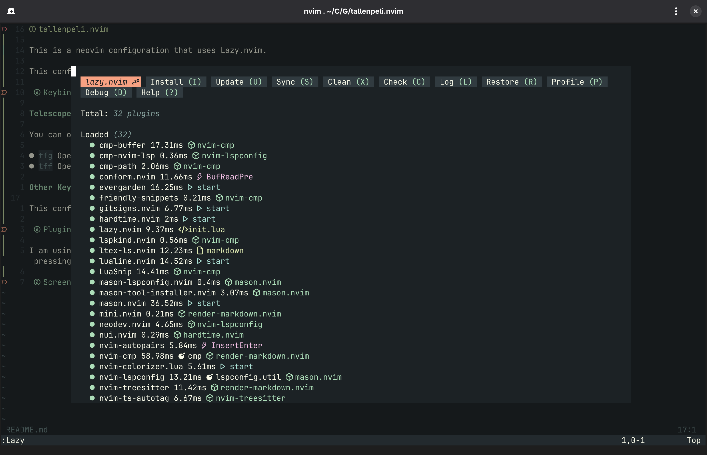

# tallenpeli.nvim

This is a neovim configuration that uses Lazy.nvim.

This configuration is "minimal", but has a lot of nice features built in.

## Keybinds

**Telescope**

You can open telescope and it's different search types by using the following keybinds.

- `tfg` Opens the grep search view
- `tff` Opens the file search view

**Other Keybinds**

This configuration uses standard vim/neovim keybinds.

## Plugin notes

I am using [Hardtime.nvim](https://github.com/m4xshen/hardtime.nvim) which forces you to use good vim motions, so if you are being told to stop pressing the `j` key, then maybe try to have better vim habbits.

## Screenshots

