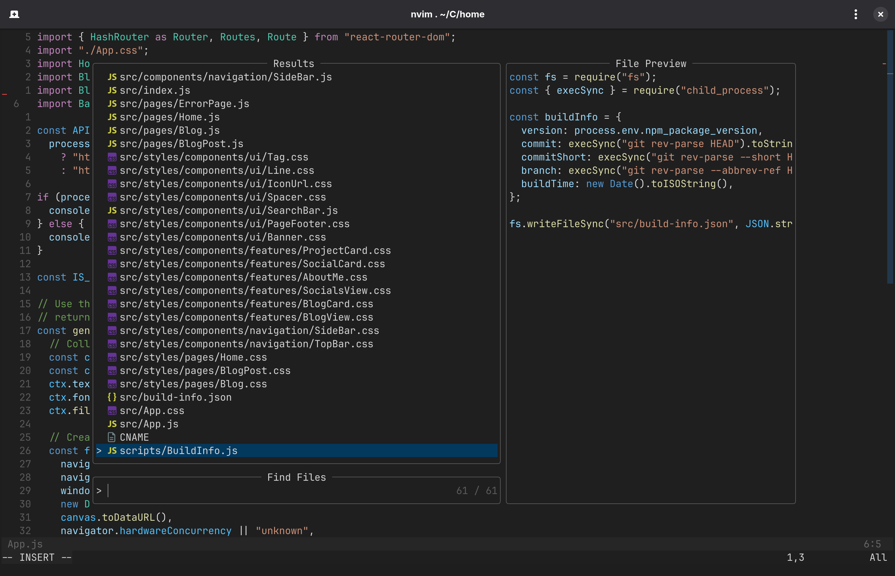
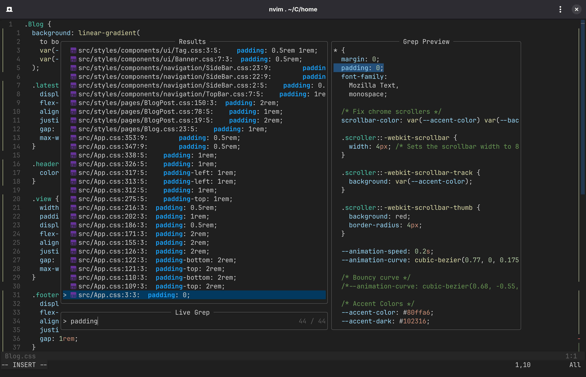
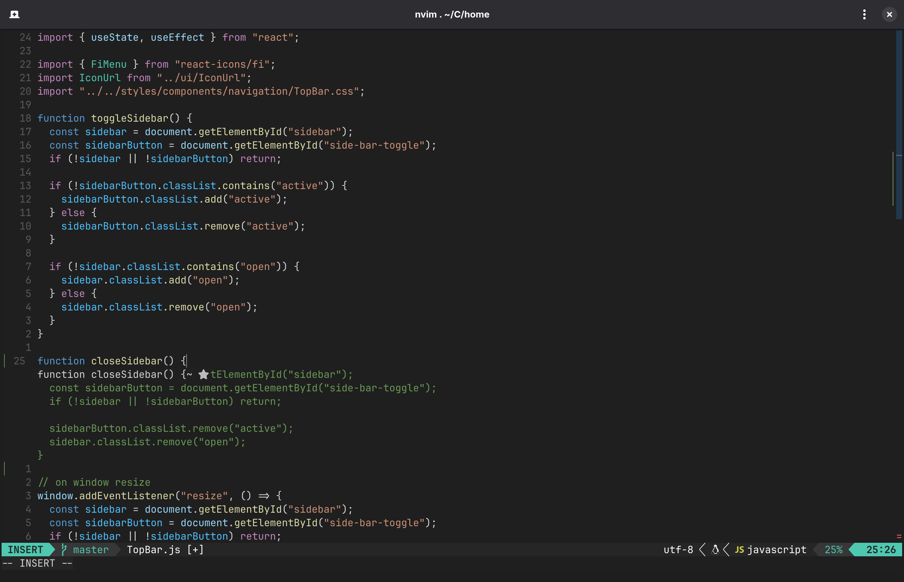
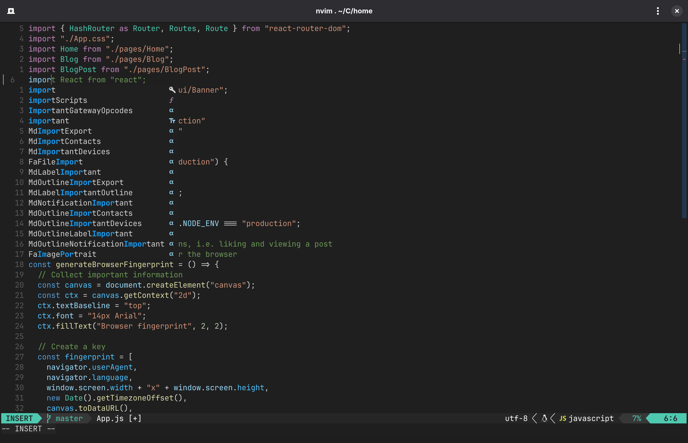

# tallenpeli.nvim

This is a neovim configuration that uses Lazy.nvim.

This configuration is "minimal", but has a lot of nice features built in.

## Keybinds

**Telescope**

You can open telescope and it's different search types by using the following keybinds.

- `<Space>g` Opens the grep search view
- `<Space>F` Opens the file search view
- `<Space>b` Opens the buffers search view
- `<Space>h` Opens the help search view

**Other Keybinds**

- `<Space>e` Opens the error/debug line

**Other Keybinds**

This configuration uses standard vim/neovim keybinds.

## Screenshots

