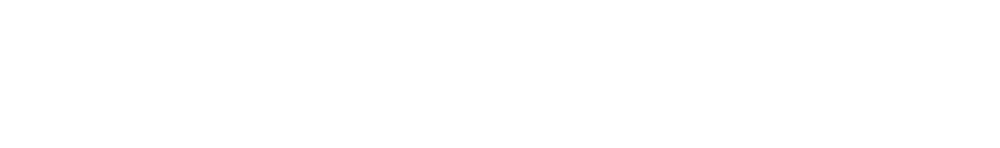
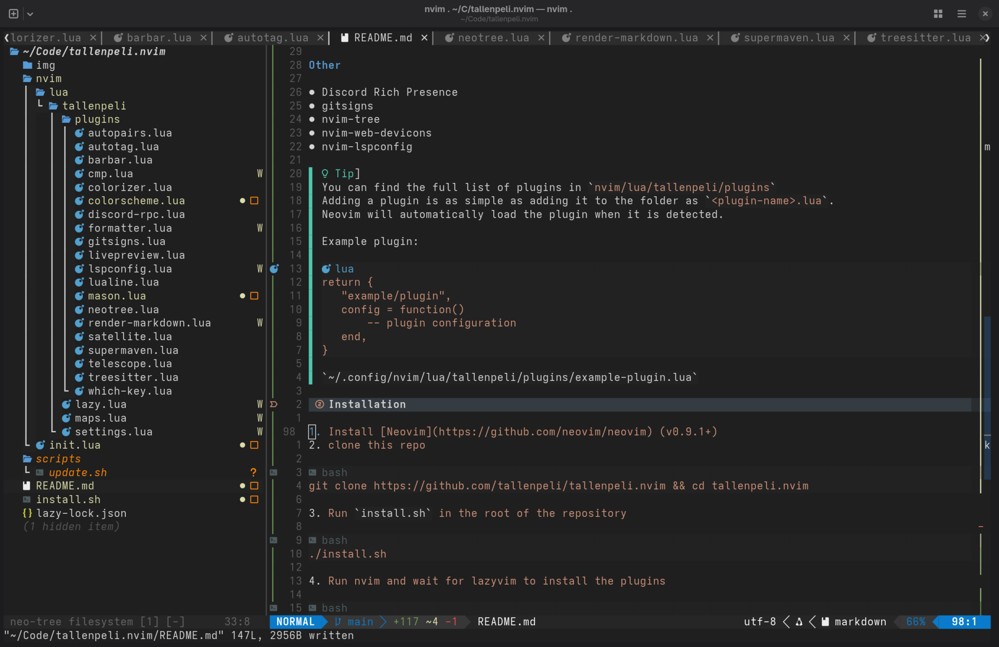
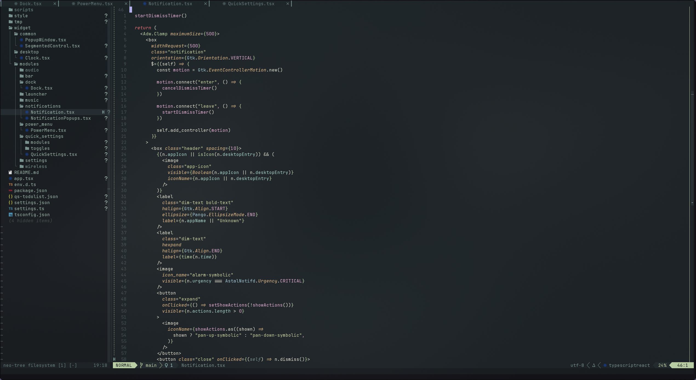
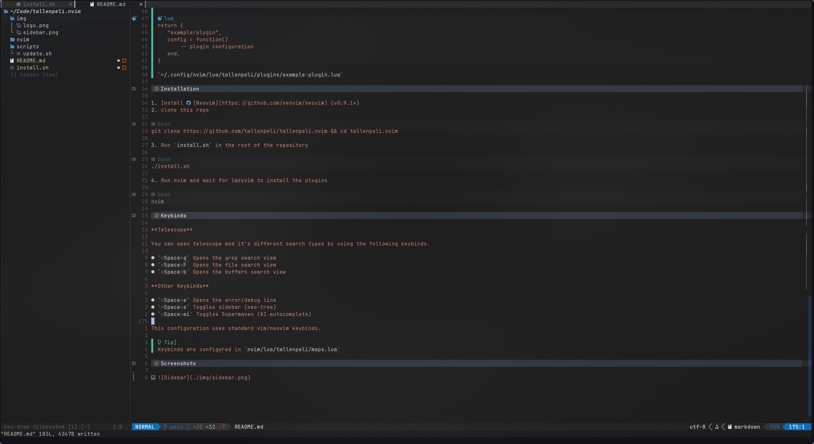
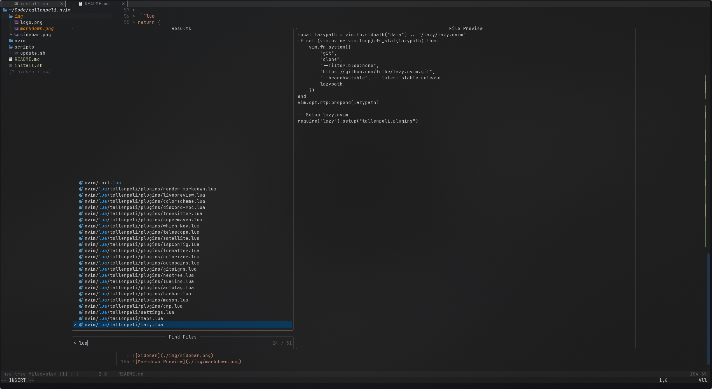
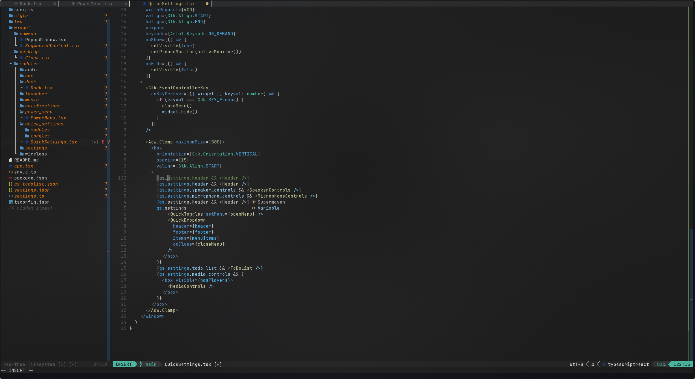

# tallenpeli.nvim



This is a neovim configuration that uses Lazy.nvim. Primarily designed for my programming needs, but I will check issues and PRs for things people want to see.

This config is designed for full-stack development, from front-end to back-end with javascript/typescript, HTML, go, rust, and more.

[**Install instructions**](#Installation)

## What does tallenpeli.nvim include?

tallenpeli.nvim includes a suite of features for seamless programming without having to worry about setup. Here are some of the features preconfigured in this config.

### **LSPs (mason.nvim)**

<details>
    <summary>Click to expand</summary>
     <ul>
        <li>cssls (css)</li>
        <li>eslint (javascript/typescript/tsx/jsx)</li>
        <li>html (html)</li>
        <li>jsonls (json)</li>
        <li>ts_ls (typescript/tsx)</li>
        <li>pyright (python)</li>
        <li>clangd (c/cpp)</li>
        <li>rust_analyzer (rust)</li>
        <li>gopls (go)</li>
        <li>lua_ls (lua)</li>
        <li>jdtls/<li>
    </ul>

</details>

### **Formatters/Linters (mason.nvim)**

<details>
    <summary>Click to expand</summary>
    <ul>
        <li>prettier (javascript/typescript/tsx/jsx)</li>
        <li>stylua (lua)</li>
        <li>isort</li>
        <li>black</li>
        <li>pylint (python)</li>
        <li>eslint_d (javascript/typescript/tsx/jsx)</li>
    </ul>
</details>

### **Telescope**

<details>
    <summary>Click to expand</summary>
    <ul>
        <li>Telescope</li>
        <li>Telescope Grep</li>
        <li>Telescope File</li>
        <li>Telescope Buffers</li>
    </ul>
</details>

### **Autocomplete**

<details>
    <summary>Click to expand</summary>
    <ul>
        <li>nvim-cmp</li>
        <li>nvim-cmp-buffer</li>
        <li>nvim-cmp-path</li>
        <li>nvim-cmp-nvim-lsp</li>
    </ul>
</details>

### **Colorscheme**

<details>
    <summary>Click to expand</summary>
    <ul>
        <li>VSCode</li>
        <li>Adwaita</li>
        <li>Evergreen</li>
        <li>Catppuccin</li>
    </ul>
</details>

### **Developer Tools**

<details>
    <summary>Click to expand</summary>
    <ul>
        <li>Live Preview (for HTML, markdown, svg, asciidoc)</li>
        <li>Render Markdown</li>
        <li>Supermaven (AI autocomplete)</li>
        <li>gitsigns</li>
    </ul>
</details>

### **Quality of Life**

<details>
    <summary>Click to expand</summary>
    <ul>
        <li>autopairs/autotag</li>
        <li>barbar</li>
        <li>cmp</li>
        <li>colorizer</li>
        <li>lualine</li>
        <li>nvim-tree</li>
        <li>nvim-web-devicons</li>
        <li>vim.lsp</li>
    </ul>
</details>

### **Other**

<details>
    <summary>Click to expand</summary>
    <ul>
        <li><strong>Discord Rich Presence</strong> (can be disabled by deleting <code>nvim/lua/tallenpeli/plugins/discord-rpc.lua</code>)</li>
    </ul>
</details>

> [!TIP]
> You can find the full list of plugins in `nvim/lua/tallenpeli/plugins`
> Adding a plugin is as simple as adding it to the folder as `<plugin-name>.lua`.
> Neovim will automatically load the plugin when it is detected.
>
> Example plugin:
>
> ```lua
> return {
>    "example/plugin",
>    config = function()
>        -- plugin configuration
>    end,
> }
> ```
>
> `~/.config/nvim/lua/tallenpeli/plugins/example-plugin.lua`

## Installation

1. Install [Neovim](https://github.com/neovim/neovim) (v0.9.1+)
2. clone this repo

```bash
git clone https://github.com/tallenpeli/tallenpeli.nvim && cd tallenpeli.nvim
```

3. Run `install.sh` in the root of the repository

```bash
./install.sh
```

4. Run nvim and wait for lazyvim to install the plugins

```bash
nvim
```

## Keybinds

**Telescope**

You can open telescope and it's different search types by using the following keybinds.

- `<Space>g` Opens the grep search view
- `<Space>F` Opens the file search view
- `<Space>b` Opens the buffers search view

**Other Keybinds**

- `<Space>e` Opens the error/debug line
- `<Space>s` Toggles sidebar (neo-tree)
- `<Space>ai` Toggles Supermaven (AI autocomplete)

This configuration uses standard vim/neovim keybinds.

> [!TIP]
> Keybinds are configured in `nvim/lua/tallenpeli/maps.lua`

## Themes

- [VSCode](https://github.com/Mofiqul/vscode.nvim)
- [Adwaita](https://github.com/Mofiqul/adwaita.nvim)
- [Evergreen](https://github.com/comfysage/evergreen)
- [Catppuccin](https://github.com/catppuccin/nvim)

If you would like to add a theme to this config, please open an issue and I will add it if I like it.

## Screenshots

![Alpha](./img/alpha.png





